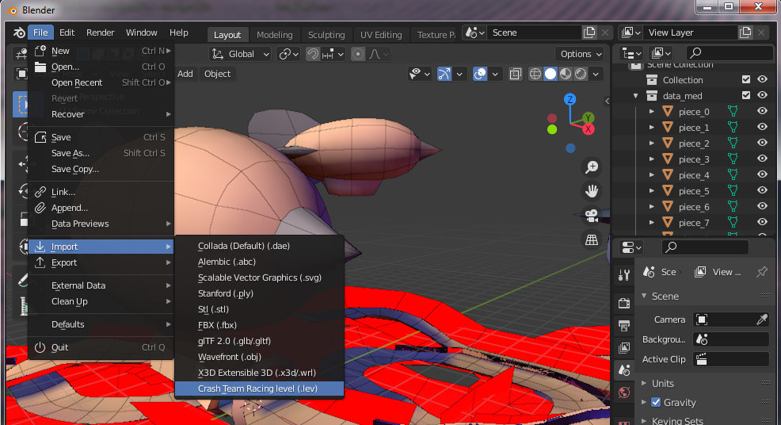

# io_ctr_tools
io_ctr_tools is a Blender plugin, capable to import untextured LEV mesh with vertex colors from Crash Team Racing (PS1).

_Warning: this is just a proof of concept, to extract fully textured models use CTR-tools: https://github.com/CTR-tools/CTR-tools_

Python LEV parser is generated automatically using Kaitai-Struct: https://github.com/kaitai-io/kaitai_struct_compiler \
KSY file can be found here: https://github.com/CTR-tools/CTR-tools/blob/master/formats/ctr_lev.ksy \
For other CTR related tools check https://github.com/CTR-tools/CTR-tools

## How to install
This plugin relies on Kaitai-Struct Python runtime:
1. Download https://raw.githubusercontent.com/kaitai-io/kaitai_struct_python_runtime/master/kaitaistruct.py and put in scripts\modules folder
2. Download io_ctr_tools and extract to scripts\addons folder
3. Enable addon via Edit -> Preferences -> Add-ons -> Community tab

